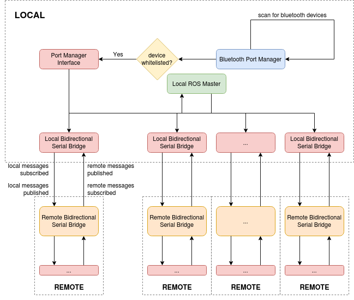

# The bluetooth_bridge package

This package utilizes bidirectional communication to facilitate serial communication of ROS messages between two workstations.
This enables multiagent systems to relay information when in close proximity without having to rely on a centralized communication network that may suffer from reliability issues.

This package is indended to be used with bluetooth devices, but is compartimentalized such that any communication device that can connect to a Python serial object, or a virtual linux serial port should work.
While using other technologies may increase operational distance between agents, bandwidth may be reduced.

Advantages of this package:
   - low latency
   - high message reliability
   - scalable to multiple connections*
   - low computational overhead

There are two main libraries in this package. These are described below, but please check each package README for more details.

## serial_bridge
This is a ROS oriented package for full-message serial communication between two PCs over a serial port and is based on the `rosserial` protocol. 

Note that `bluetooth_bridge` differs from standard `rosserial` packages which:
   - Only allow for unidirectional communication 
   - Assume the serial device is a microcontroller
   - Require the generation of a modified `ros_lib` to compile against

`serial_bridge` has two main components:

### bidirectional_serial_bridge
This class and its corresponding launchpad node `bidirectional_serial_node` are responsible for communicating with other `bidirectional_serial_bridge`s on one or more remotes. 

### port_manager_interface
This node is a ROS interface between the `bluetooth_port_manager` library and one or more local `bidirectional_serial_bridge`. 
It manages the scanned devices from the `bluetooth_port_manager` and the resources it provides to create or destroy a serial bridge.

## blueooth_port_manager
This accesses Bluetooth hardware intefaces to scan and detect known agents and negotiate the creation of a virtual serial port to be used by `serial_bridge`. 
Note that this `Manager` also avoids the exclusivity of being either a `client` or a `server`. The `Manager` can be both a `client` and `server` to a number of other agents. 

With the `Manager` acting as a negotiator, the resolution and hand-off of agent-local information to nearby agents via `serial_bridge` nodes is entirely autonomous.

**Note:** the `bluetooth_port_manager` can either connect to bluetooth devices using virtual Linux ports, or via python `serial` objects. The former method isn't recommended and is the legacy method of connecting serial ports in this package.

## System model
As a system, the `bluetooth_port_manager` and `port_manager_interface` instances run on each machine. As machine's bluetooth devices are discovered, `bidirectional_serial_bridge`s are spun up for each connected remote device. See the model below

## Project Status
Stable. Working and tested with between two ROS Masters as long as the data shared is within the bandwidth limitations of Bluetooth.

### What's in development
 - Multiple simultaneous bridge connections

# Installation
Python3.5 is required for this project. It does not need to be your default python version, but it does need to be installed.

## Install necessary packages
Install bluetooth C libraries:

    $ sudo apt-get install libbluetooth-dev bluez bluez-tools python3.5

and install python bluetooth wrappers and utilities

    $ sudo python3 -m pip install pygatt pygattlib pybluez

### Additional Steps
    
To avoid needing to run Python with sudo access, run the following command:

    $ sudo setcap 'cap_net_raw,cap_net_admin+eip' /usr/bin/python3.5

Patch local pybluez installation:

    $ roscd bluetooth_bridge/scripts && sudo ./repair_pybluez.bash

Ensure that your computer's bluetooth is enabled, and visible

    $ roscd bluetooth_bridge/scripts && ./enable_bluetooth.bash
    $ ./make_visible.bash

Finally, install the catkin packages:

    $ cd ~/CATKING_WORKSPACE_NAME
    $ catkin build bluetooth_bridge

### Setup complete
The local system is now ready to setup virtual serial ports over bluetooth. Repeat this installation on any remote machines that you wish to connect to via serial.

# Running the project

## Configuration
### Whitelisting devices
Prior to connecting to other bluetooth devices, you need to add the MAC Address of that device to the whitelist configuration files. This needs to be specified only for the `bluetooth_port_manager`.
The default whitelist location for the `bluetooth_port_manager` is 

    bluetooth_port_manager/src/bluetooth_port_manager/config/whitelist.yaml
    
Follow the same format and add/replace addresses as necessary.

### Whitelisting topics
You can also specify which topics you want to expose over the serial bridge by setting the `/serial_bridge/shared_topics_path` ros parameter to the location of a yaml file that descrbes this. The default topic file is located at 

    bluetooth_bridge/serial_bridge/config/demo_topics.yaml

Follow the same format and create topic files for your use. Note that this rosparameter can be set as an argument in the `port_manager_interface.launch` file.
    

## Launch

To run as a full system you only need to run one launch file:

    $ roslaunch serial_bridge port_manager_interface.launch

This handles the scanning, detection, connection and resource management of serial ports from friendly bluetooth devices.

## Legacy mode
To connect over virtual Linux ports, follow these steps. Note that you do not have the advantages of the `port_manager_interface` when using `legacy mode`.

    $ sudo ./port_manager.py
    $ roslaunch serial_bridge serial_bridge.launch 

# Running the Demo
To run this demo, you must have:

  - Two machines each with this project stack present, installed, and configured
  - Each machine's bluetooth device address has been added to their own local whitelist, as well as the whitelist of their remote, in accordance to the **Configuration** section

Then run the following steps on each machine:
    
    $ roscore
    $ roscd serial_bridge/scripts && ./demo_publishers
    $ roslaunch serial_bridge port_manager_interface.launch

After the bluetooth devices are found and connected, publishers will be setup on each machine with information published by the respective remote machine. If you run 

    $ rostopic list

you should see two new published topics, `remote_hostname/example0/cmd_vel` and `remote_hostname/example1/cmd_vel`, each publishing messages at 5Hz

# Further Documentation
The `bluetooth_port_manager` package is a simple Python library and can be run independently. Please consult its README for more information about the package.
Further, the `serial_bridge` contains a README with additional information as well.
